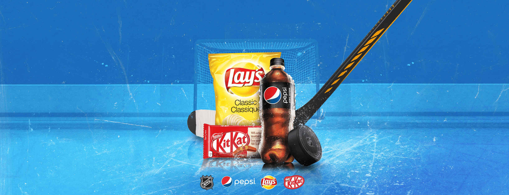

# Drink. Snack. Score.

Drink. Snack. Score. was a promotion for Circle K and Mac’s Convenience Stores in association with the NHL.
It was a managed contest system which reached hundreds of thousands of users across Canada.
The contest involved users selecting a province, submitting their phone number
and shooting a puck to hit targets to win grand prize entries. Daily prizes were allocated per BU
and awarded at random. When users won a prize, they were sent an SMS with access to their **coupon book**.

