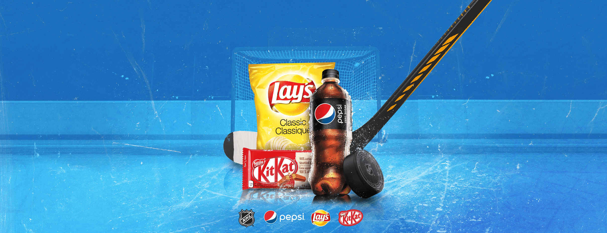

import DSScouponbook from '../../../video/DSS-couponbook.mp4'
import DSSgameplay from '../../../video/DSS-gameplay.mp4'

# Drink. Snack. Score.

Drink. Snack. Score. was a promotion for Circle K and Mac’s Convenience Stores in association with the NHL & Pepsi.
It was a managed contest system which reached hundreds of thousands of users across Canada.
The contest involved users selecting a province, submitting their phone number
and shooting a puck to hit targets to win grand prize entries. Daily prizes were allocated across business units
and awarded at random. When users won a prize, they were sent an SMS with access to their **coupon book**.

<IFrame source={"https://www.facebook.com/plugins/video.php?height=314&href=https%3A%2F%2Fwww.facebook.com%2FCircleKAtlantic%2Fvideos%2F709590946349443%2F&show_text=false&width=560"} title="Facebook Drink. Snack. Score. Video Advertisement"/>

### My Role
This website was an isomorphic next.js application built ontop of SIX12 Creative's architecture. As the lead developer for
the Next.js architecture, I initialized the structure of directories, setup serverside model based architecture, integrated test suites, devised a central
state management solution, and managed pull requests.

### Gameplay
>These promotions are mobile centric designs. They are designed to drive foot traffic to Circle K & Macs Convenience Stores.

<Video source={DSSgameplay}/>

### Coupons

When the user won an instant prize, they were sent an SMS with a link to their couponbook. A couponbook is a private link (not meant to be shared)
that users can access via SMS message to view and redeem their coupons & prizes they have won from the promotion. Below you'll see an example
of the couponbook and the in-store redemption process.

<Video source={DSScouponbook}/>

